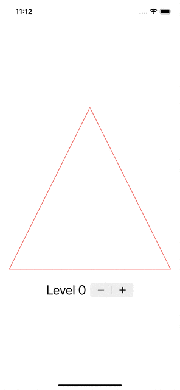

# SwiftUI - SierpinskiTriangle
 

  
  

  

## Acknowledgements
This project was inspired by following

- [Paul Hudson - Creating custom paths with SwiftUI](https://www.youtube.com/watch?v=2nYa0RpQtE4) 
- [Mark Moeykens - SwiftUI Shapes Live session](https://www.youtube.com/watch?v=7_vScyZP6EM&t=2001s)

In the past, I used to develop the graffiti system by Unity. Also, I am really into the computer graphic field. I used to create some graphics with OpenCV during my university. So when it comes the SwiftUI's shape and path, it inspires this small project.
